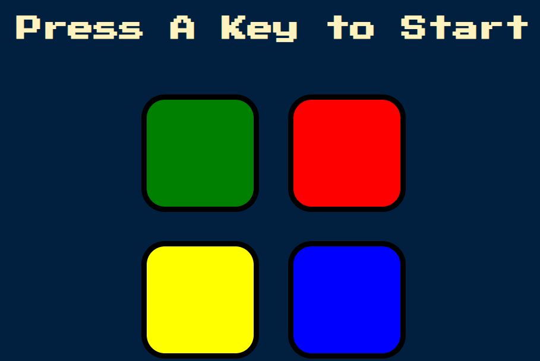

# Simon Game

Simon is an electronic game of memory skills invented by Ralph H. Baer and Howard J. Morrison, who work for toy design company Marvin Glass and Associates, with software programming by Lenny Cope. This version of game created with HTML, CSS, Javascript, & jQuery and also implementing responsive web design and DOM manipulation.

## Preview



## Installation

```bash
Download repo 
Run index.html
```

## Contributing
Pull requests are welcome. For major changes, please open an issue first to discuss what you would like to change.

Please make sure to update tests as appropriate.

## License
[MIT](https://choosealicense.com/licenses/mit/)
